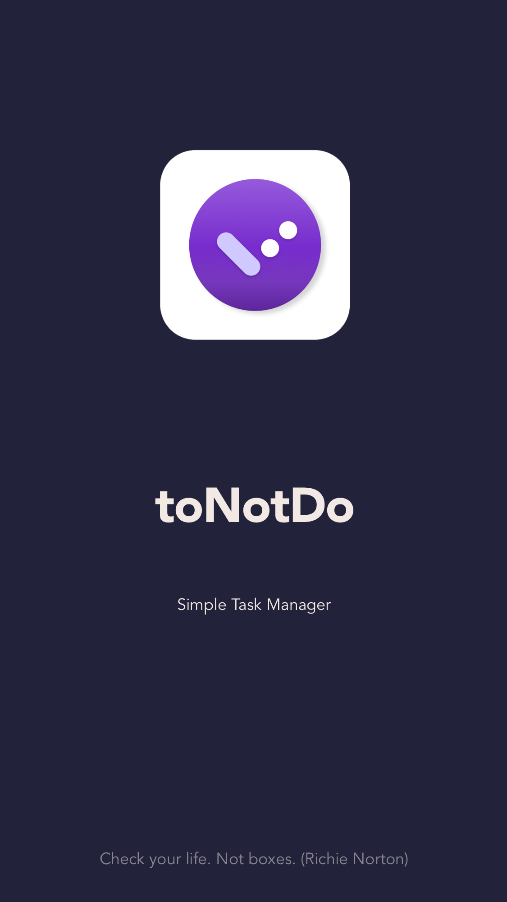
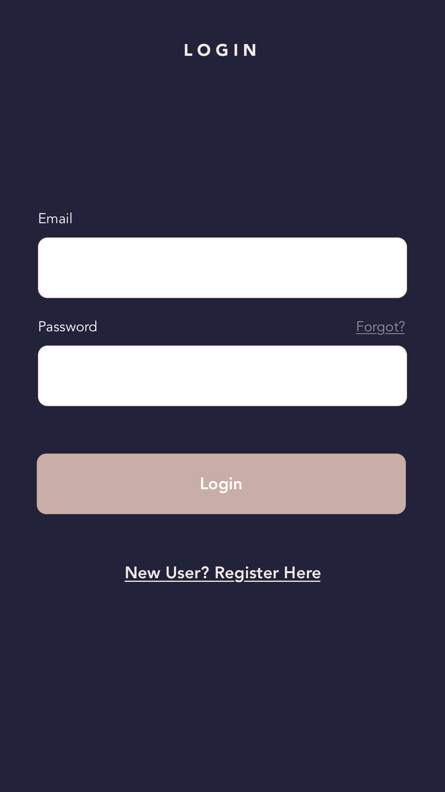
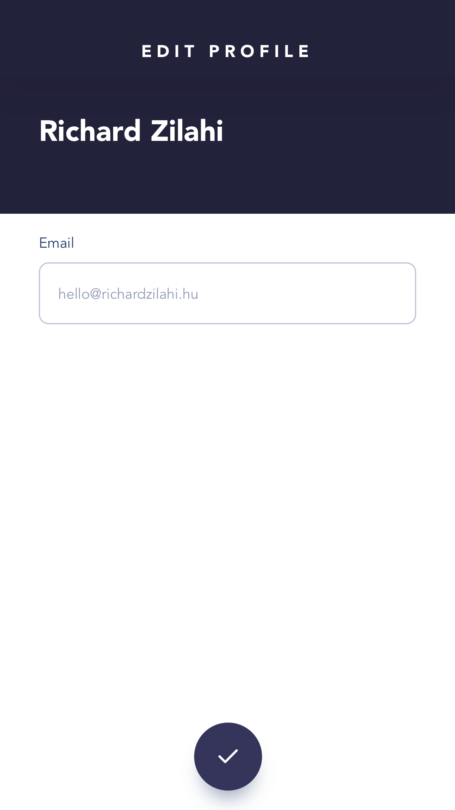
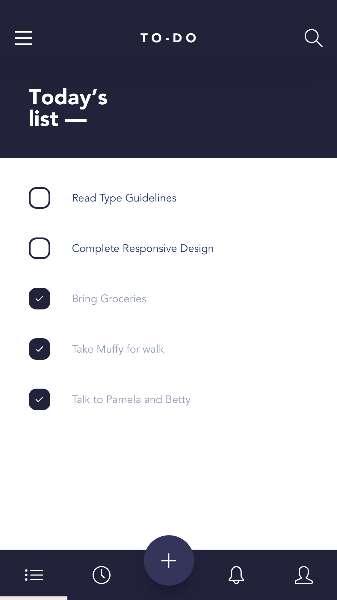
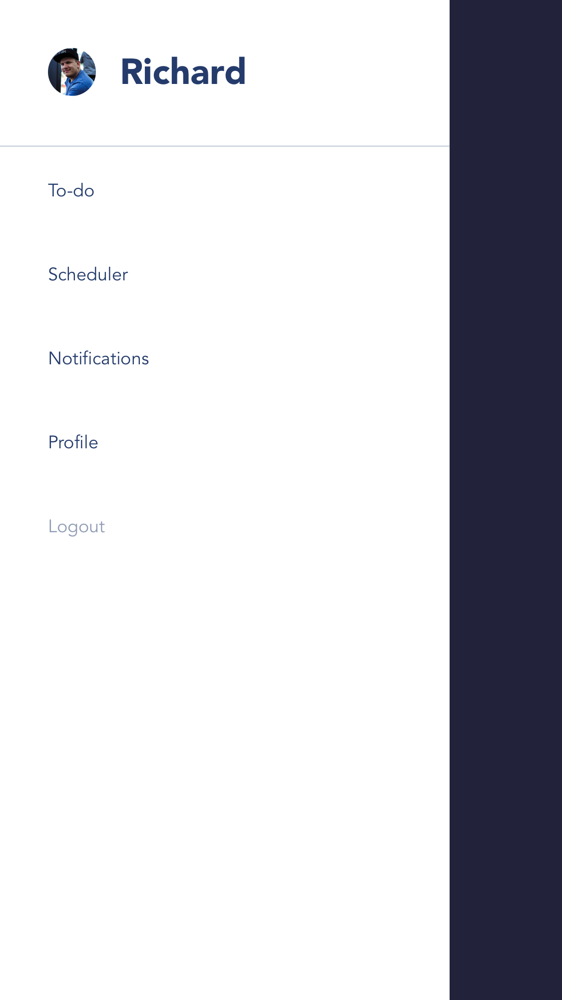
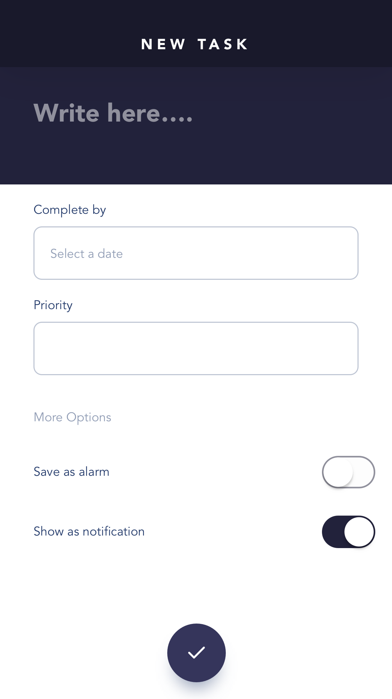
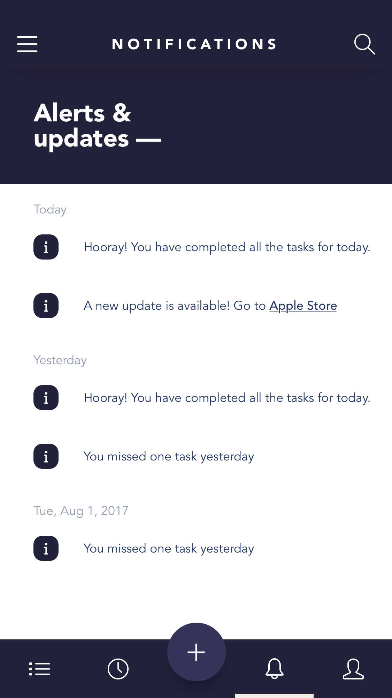
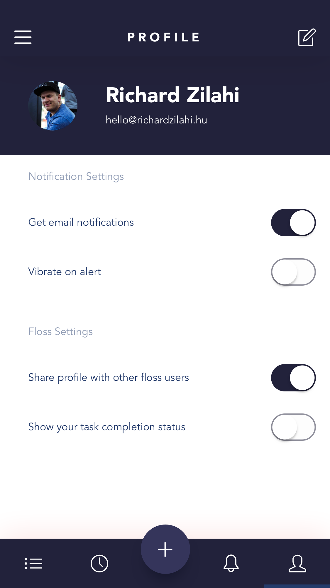
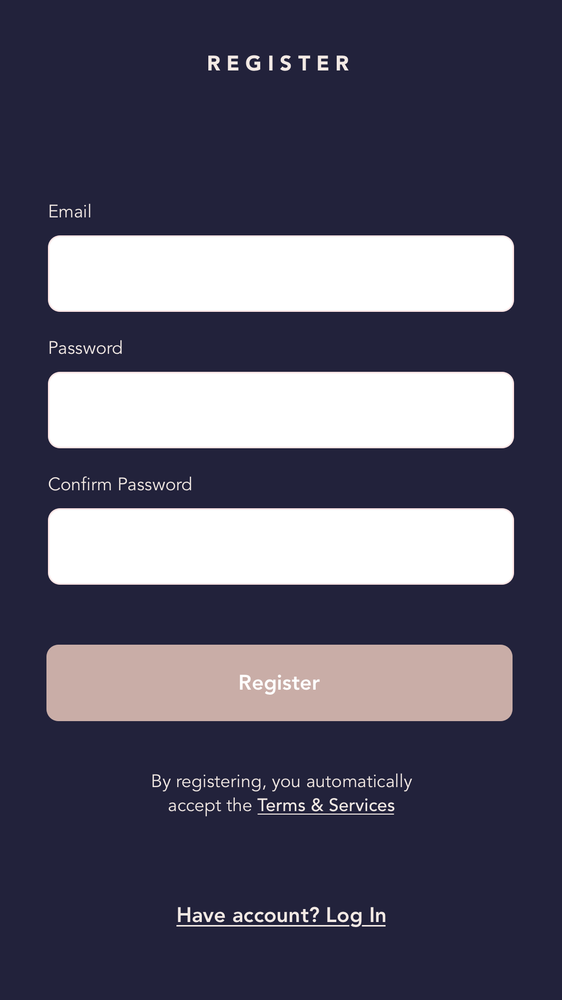
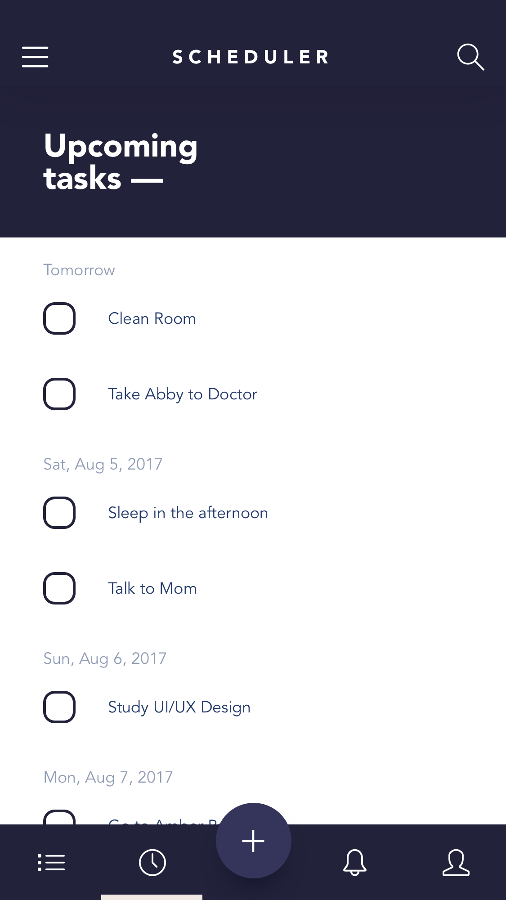

# Todo App

This application is created for the course _Building And Deploying Cross Platform Applications" (R0335-3003), Assignment 5

## Team

The team is made of the following students:

| name           | studentId | emailAddress            |
|----------------|-----------|-------------------------|
| Pavel Arkharov |           | arkharovp@gmail.com     |
| Menno Jager    |  2104983  | menno.c.jager@gmail.com |

## The Application

We've chosen to build and implement a ver simple todo app.

## Design

## User Interface

The _User Interface_ of the application is made of the follwing screens

## Functional flow

<!-- prettier-ignore-start -->
<!-- markdownlint-disable -->
<table>
    <tr>
        <td>
            splashscreen
        </td>
        <td> </td>
        <td>
            
        </td>
    </tr>
    <tr>
        <td>
            login
        </td>
        <td> </td>
        <td>
            
        </td>
    </tr>
    <tr>
        <td>
            editProfile
        </td>
        <td> </td>
        <td>
            
        </td>
    </tr>
    <tr>
        <td>
            todoList
        </td>
        <td> </td>
        <td>
            
        </td>
    </tr>
    <tr>
        <td>
            sidemenu
        </td>
        <td> </td>
        <td>
            
        </td>
    </tr>
    <tr>
        <td>
            newtask
        </td>
        <td> </td>
        <td>
            
        </td>
    </tr>
    <tr>
        <td>
            notifications
        </td>
        <td> </td>
        <td>
            
        </td>
    </tr>
    <tr>
        <td>
            profile
        </td>
        <td> </td>
        <td>
            
        </td>
    </tr>
    <tr>
        <td>
            signUp
        </td>
        <td> </td>
        <td>
            
        </td>
    </tr>
    <tr>
        <td>
            scheduler
        </td>
        <td> </td>
        <td>
            
        </td>
    </tr>
</table>

<!-- markdownlint-restore -->
<!-- prettier-ignore-end -->

